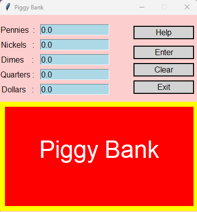

```
# Piggy Bank Application



## Author
**Jeremiah E. Ochepo**  
*Last Edited: November 5, 2024*

## Description
The Piggy Bank application is a graphical user interface (GUI) tool that allows users to input various denominations of coins and bills to calculate their total savings. The application checks if the user has enough money to buy a gift card and displays the remaining balance. This project was built using Python and the `graphics.py` library.

## Features
- Input fields for different denominations: pennies, nickels, dimes, quarters, and dollars.
- Calculates the total amount in dollars based on the user's input.
- Displays the number of gift cards that can be purchased with the current balance.
- Provides clear instructions for user input.
- A simple UI with a welcoming background and interactive buttons.
- Reset functionality to clear inputs and restart the application.

## Screenshots
1. **Piggy Bank Cartoon**  
   

2. **Piggy Bank User Interface**  
   

## Installation
1. Clone the repository:
   ```bash
   git clone https://github.com/yourusername/piggy-bank.git
   cd piggy-bank
   ```
2. Make sure you have Python installed (preferably Python 3).
3. Install the `graphics.py` library if it's not already available:
   ```bash
   pip install graphics.py
   ```

## Usage
1. Run the application:
   ```bash
   python app/main.py
   ```
2. Input your coin and bill amounts in the respective fields.
3. Click on the **Enter** button to calculate your total savings and the number of gift cards you can purchase.
4. Click on the **Help** button to view input instructions.
5. Use the **Clear** button to reset the input fields and start over.
6. Click on the **Exit** button to close the application.

## Code Structure
The project is organized into the following directories and files:

Piggy-Bank-application
├── app
│   ├── gui
│   │   └── gui.py              # Main GUI implementation for the Piggy Bank application
│   ├── main.py                 # Entry point of the application, initializes the GUI and logic
│   ├── button.py               # Button functionality and interaction handling
│   └── piggy_bank.py           # Logic and calculations for the Piggy Bank
├── utils
│   └── graphics.py             # Simple object-oriented graphics library
├── screenshots
│   ├── piggy-bank-cartoon.png  # Image of a cartoon piggy bank for UI
│   └── piggy-bank-ui.png       # Screenshot of the application UI
├── readme.md                   # Documentation for the project
└── structure.txt               # Text file documenting the project structure


- **utils/**: Contains utility functions and classes.
  - `graphics.py`: A simple graphics library used for rendering GUI components.

## Classes and Functions
### PiggyBank Class
The main class that manages user input, calculations, and GUI components. Key methods include:
- `setPennies()`, `setNickels()`, `setDimes()`, `setQuarters()`, `setDollars()`: Set input fields for respective coin denominations.
- `reset()`: Resets all input fields to default values.
- `totalDeposit()`: Calculate the total amount based on valid inputs.
- `Transaction()`: Determine the number of gift cards that can be purchased with the total amount.
- `displayOutputBox()`: Create a box to show the result to the user.
- `helpMsg()`: Display instructions for the user.

### GUI Class
- `PiggyBankGUI`: Handles the creation of GUI elements and updates the output display.
- Button functions: Create and activate buttons for help, enter, clear, and exit functionalities.

## Error Handling
The application performs basic input validation and error handling. If invalid input is detected, an error message is displayed, guiding the user to correct the input. It also checks for valid inputs and returns `0.00` if all fields are filled with `0`.

## Contributing
Feel free to fork the repository and submit pull requests for any improvements or features you'd like to add!

## License
This project is licensed under the MIT License.
```
